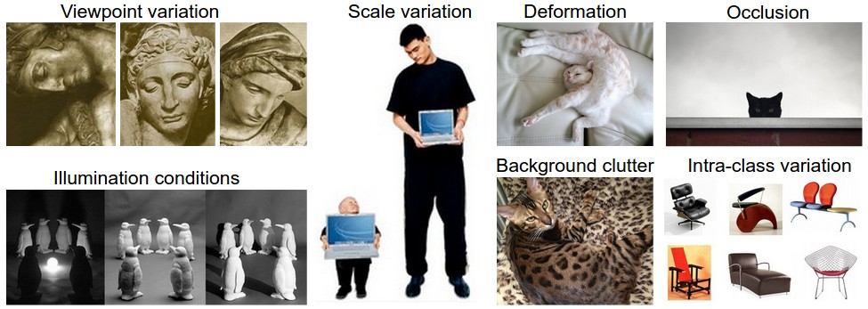

这是一个介绍性讲座，旨在介绍图像分类问题以及数据驱动方法。目录：

- [Intro to Image Classification, data-driven approach, pipeline](#image-classification)
- Nearest Neighbor Classifier
  - k-Nearest Neighbor
- Validation sets, Cross-validation, hyperparameter tuning
- Pros/Cons of Nearest Neighbor
- Summary
- Summary: Applying kNN in practice
- Further Reading

# Image Classification

**动机 ：**在本节中，我们将介绍图像分类问题，它是从一组固定的类别中为输入图像分配一个标签的任务。这是计算机视觉中的核心问题之一，尽管它很简单，但却有各种各样的实际应用。而且，正如我们在课程后面会看到的，许多其他看似不同的计算机视觉任务（如对象检测，分割）可以简化为图像分类。

**例子 ：**在下面的图像中，图像分类模型将单个图像按照概率分配到4个标签*{猫，狗，帽子，马克杯}*。如图所示，请记住，对于计算机来说，图像被表示为一个大的三维数字数组。在这个例子中，猫的图像宽248像素，高400像素，并且有三个颜色通道红色，绿色，蓝色（简称RGB）。因此，图像由248 x 400 x 3个数字组成，或总共297,600个数字。每个数字是一个整数，范围从0（黑色）到255（白色）。我们的任务是将一百万个数字转换为单个标签，例如*“猫”*。


图像分类的任务是预测给定图像的单个标签（或标签上的分布，如图所示，以表示我们的置信度）。图像是从0到255的整数的三维数组，大小为宽x高x 3 .3代表三个颜色通道红色，绿色和蓝色。

**挑战**。由于识别视觉概念（例如猫）的任务对于人类来说是相对微不足道的，因此从计算机视觉算法的角度考虑所涉及的挑战是值得的。正如我们在下面提出的一个无穷无尽的挑战列表，请记住图像的原始表示形式（为亮度值的三维阵列）：

- **视角变化：**对象的单个实例相对于相机可以以多种角度。
- **比例变化：**视觉类通常表现出尺寸的变化（在现实世界中的大小，不仅仅是图像的大小）。
- **变形：**许多感兴趣的物体不是刚体，可能会以极端方式变形。
- **遮挡：**感兴趣的对象可以被遮挡。有时只有一小部分对象（只有少数像素）可见。
- **光照条件：**照明的影响在像素级上非常剧烈。
- **背景混淆：**感兴趣的对象可以*融合*到他们的环境，使他们很难辨认。
- **类间变化(Intra-class variation)：**感兴趣的对象通常可能比较宽泛的概念，如*椅子*。这些物体有许多不同的类型，每种都有自己的外观。

良好的图像分类模型必须对所有这些变化的交叉乘积保持不变，同时保持对类间变化的敏感性。



**数据驱动的方法**。我们可以怎样去编写一个可以将图像分类到不同类别的算法？与编写用于对数字列表进行排序的算法不同，很难说如何编写用于识别图像中猫的算法。因此，我们将不会像在孩子身上所采取的那种方式那样，不是直接在代码中指定每种感兴趣的类别，而是要为计算机提供每个类很多示例和迭代的学习算法。同过查看这些例子，学习到每个类的视觉外观。这种方法被称为*数据驱动方法*，因为它依赖于首先累积的*训练数据集*标记图像。下面是一个这样的数据集的例子：


四个视觉类别的示例训练集。实际上，我们可能会为每个类别设置数千个类别和数十万个图像。

**图像分类管道**。我们已经看到，图像分类中的任务是获取代表单个图像的像素阵列并为其分配标签。完整的流程可以形式化如下：

- **输入 :**我们的输入由一组*N个*图像组成，每个图像用*K个*不同类别中的一个标记。我们将这些数据称为*训练集*。
- **学习 :**我们的任务是使用训练集来了解每个类的外观。我们将这一步称为*训练分类器*，或者*学习模型*。
- **评估 :**最后，我们评估分类器的质量，通过要求它为一组以前从未见过的新图像预测标签。然后，我们将比较这些图像的真实标签与分类器预测的标签。直觉上，我们希望很多预测与真实答案（我们称之为*基本事实*）相匹配。

#Nearest Neighbor Classifier
作为我们的第一种方法，我们将开发我们称之为最近邻分类器。 这种分类器与卷积神经网络无关，在实践中也很少使用，但它可以让我们了解图像分类问题的基本方法。
**示例图像分类数据集：CIFAR-10。** [CIFAR-10](www.cs.toronto.edu/~kriz/cifar.html)是一种流行的图像分类(小)数据集。 该数据集由60,000个宽高32像素的小图像组成。每个图像都标注为10个类别之一（例如“飞机，汽车，鸟类等”）。这60,000个图像被分成50,000个图像的训练集和10,000个图像的测试集。 在下面的图片中，您可以看到每个类的10个随机示例图像：

假设现在我们获得了50,000张图像的CIFAR-10训练集（每个标签有5,000张图像），并且我们希望标注剩余的10,000张图像。最近的邻居分类器将拍摄测试图像，将其与每个训练图像进行比较，并预测最接近训练图像的标签。在上图和右图中，您可以看到10个示例测试图像的预测结果。请注意，在10个示例中，只有3个示例获取了同一类的图像，而在其他7个示例中，情况并非如此。例如，在第8行中，与马头图像最接近的训练图像是红色车，大概是受到黑色背景的强烈干扰。因此，在这种情况下，这匹马的图像会被误认为是汽车。
您可能已经注意到，我们没有详细说明我们如何比较两幅图像的细节，在这种情况下，这两幅图像只是两个32 x 32 x 3的图块。最简单的可能性是逐个像素地比较图像并将所有图像的差异相加。 换句话说，给定两幅图像并将它们表示为矢量I1，I2，比较它们的合理选择可能是L1距离：
$$
d_1 (I_1, I_2) = \sum_{p} \left| I^p_1 - I^p_2 \right|
$$
总和是所有像素差值相加。下面是可视化的过程：

使用L1距离逐像素比较两个图像的差异（在本例中为一个颜色通道）。两个图像相减，然后所有的差值相加得到一个值。 如果两幅图像相同，结果将为零。但是如果图像非常不同，结果值会很大。
下面用代码实现这个分类器。首先，我们将CIFAR-10数据作为4个数组加载到内存中：训练数据/标签和测试数据/标签。 在下面的代码中，`Xtr`（大小为50,000 x 32 x 32 x 3）保存训练集中的所有图像，相应的一维数组`Ytr`（长度为50,000）保存训练标签（从0到9）：

```python
Xtr, Ytr, Xte, Yte = load_CIFAR10('data/cifar10/') # a magic function we provide
# flatten out all images to be one-dimensional
Xtr_rows = Xtr.reshape(Xtr.shape[0], 32 * 32 * 3) # Xtr_rows becomes 50000 x 3072
Xte_rows = Xte.reshape(Xte.shape[0], 32 * 32 * 3) # Xte_rows becomes 10000 x 3072
```


